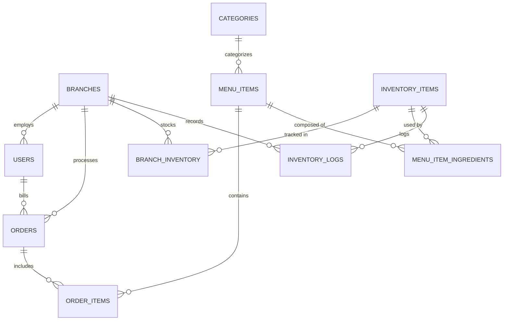

# ☕ VCafe — Multi-Branch Operations & POS Platform

> A cloud-based business management system engineered for multi-branch specialty cafes and dining operations. Built with React, Node.js/Express, PostgreSQL, and JWT-authenticated Role-Based Access Control (RBAC).

---

## 📖 The Origin Story

> *"A specialty cafe in Goa operated two outlets—one in bustling Panjim and another along the Anjuna coastal strip. Daily operations, daily billing, and inter-branch stock replenishments were tracked across paper notebooks and ad-hoc WhatsApp messages.
>
> During peak holiday rushes, the Anjuna outlet would suddenly run out of oat milk and artisan sourdough while Panjim had a surplus. Cash settlements at end-of-shift rarely tallied with register paper slips, and the cafe owner had zero consolidated visibility into store profitability without spending 3 hours every Sunday compiling paper totals.
>
> I built **VCafe** to solve this exact operational friction: giving counter staff a swift POS terminal that auto-deducts raw ingredients via recipe mappings, outlet managers live stock control and replenishment logs, and the owner unified business intelligence across all branches."*

---

## 🌟 Key Features & Business Capabilities

### 1. ⚡ High-Speed POS Checkout & Thermal Invoicing
- Fast touch-friendly menu grid with category filtering (*Espresso & Classics*, *Cold Brews & Iced Lattes*, *Artisanal Bakery*, *Gourmet Bites*).
- Real-time cart calculations including automated 5% GST (CGST 2.5% + SGST 2.5%) and optional discounts.
- Dine-in (with table assignment) and takeaway ticket support.
- Multiple payment settlement modes: **UPI (GooglePay / PhonePe / QR)**, **Credit/Debit Card**, and **Cash**.
- Instant modal generation of authentic **Thermal Print Receipts** with GSTIN, invoice numbering, line items, and print capabilities (`window.print()`).

### 2. 📦 Recipe-Driven Inventory Tracking & Stock Logistics
- **Atomic Recipe Deductions**: Placing an order for a *Signature Flat White* automatically deducts 0.018 kg of Arabica coffee beans and 0.20 L of milk directly from that specific branch's inventory ledger.
- **Safety Reorder Thresholds**: Real-time visual alert banners and badges trigger when ingredient levels drop below minimum operating safety stock.
- **Supplier Replenishment & Waste Logging**: Managers can record supplier delivery receipts or write off spoilage with audit notes.
- **Inter-Branch Stock Transfers**: Authorize and record stock transfers from the flagship branch (Panjim) to seasonal branches (Anjuna) with complete audit trail logging.

### 3. 🛡️ Role-Based Access Control (RBAC) & Security
- **👑 Owner (Universal Scope)**: Unrestricted access across all outlets, consolidated business intelligence, menu availability controls, and user authorization management.
- **👔 Manager (Branch Scope)**: Manages outlet inventory, authorizes restocks and transfers, accesses branch-specific financial metrics, and supervises branch team.
- **☕ Staff / Barista (Terminal Scope)**: Accesses high-speed POS billing, active tickets, and live material availability checks. Restricted from sensitive financial summaries and administrative settings.
- **1-Click Recruiter Demo Switcher**: Floating banner allowing reviewers to test each role's view and permission boundaries instantly.

### 4. 📊 Multi-Branch Executive Analytics
- **Consolidated vs Branch-Level Scoping**: View company-wide totals or drill into individual outlets.
- **Key Performance Indicators (KPIs)**: Gross Revenue, Completed Order Count, Average Order Value (AOV), and Low Stock Alerts.
- **7-Day Revenue Trend (Custom SVG Chart)**: Visual daily revenue progression with dynamic tooltips and scaling.
- **Top 5 Artisanal Items**: Units sold and revenue contribution ranking.
- **Payment Method Distribution**: Percentage breakdown across UPI, Card, and Cash settlements.

---

## 🏗️ System Architecture & Technology Stack

```
   ┌────────────────────────────────────────────────────────┐
   │             React 18 SPA (Vite + Vanilla CSS)          │
   │  - POS Terminal    - Executive Analytics   - Inventory │
   │  - Thermal Bill    - Demo Persona Switcher - RBAC UI   │
   └───────────────────────────┬────────────────────────────┘
                               │ HTTP / REST (JWT Bearer)
   ┌───────────────────────────▼────────────────────────────┐
   │             Node.js & Express REST API Server          │
   │  - Auth & RBAC Middleware   - Recipe Deduction Engine  │
   │  - Order Transaction Logic  - Branch Logistics Router  │
   └───────────────────────────┬────────────────────────────┘
                               │ Parameterized SQL ($1, $2)
   ┌───────────────────────────▼────────────────────────────┐
   │                  Database Storage Layer                │
   │  - Production: PostgreSQL with Connection Pool (pg)   │
   │  - Local / Test: Embedded SQLite zero-config fallback │
   └────────────────────────────────────────────────────────┘
```

### Technology Highlights
- **Frontend**: React 18, Vite, Vanilla CSS Custom Properties (Warm Espresso & Bronze Design System), Lucide Icons.
- **Backend**: Node.js, Express, JSON Web Tokens (`jsonwebtoken`), `bcryptjs` password hashing.
- **Database Architecture**:
  - **Dual Engine Persistence Layer**: Designed with a clean repository abstraction in [`server/src/config/db.js`](server/src/config/db.js).
  - **Production Mode**: Uses PostgreSQL (`pg.Pool`) with SSL and connection pooling when `DATABASE_URL` is set (Render, Supabase, Neon).
  - **Local Development Mode**: Seamlessly falls back to local SQLite storage with WAL mode when running standalone—guaranteeing 100% clone-and-run reliability without requiring a pre-installed database server!

---

## 🗄️ Database Schema & Entity Relationships



---

## 🔌 API Reference

### Authentication & Profiles (`/api/auth`)
| Method | Endpoint | Access | Description |
|---|---|---|---|
| `POST` | `/api/auth/login` | Public | Email and password authentication; returns JWT token. |
| `POST` | `/api/auth/demo-login` | Public | 1-click persona login (`owner`, `manager_panjim`, `staff_anjuna`). |
| `GET` | `/api/auth/me` | Authenticated | Retrieve current user profile and branch assignment. |
| `GET` | `/api/auth/users` | Manager / Owner | List operational staff and role permissions. |

### POS & Orders (`/api/orders`)
| Method | Endpoint | Access | Description |
|---|---|---|---|
| `POST` | `/api/orders` | Authenticated | Process new POS order with recipe stock deduction and thermal receipt. |
| `GET` | `/api/orders` | Authenticated | Fetch paginated order transaction history. |
| `GET` | `/api/orders/:id` | Authenticated | Fetch detailed order receipt by ID. |

### Inventory & Logistics (`/api/inventory`)
| Method | Endpoint | Access | Description |
|---|---|---|---|
| `GET` | `/api/inventory` | Authenticated | Retrieve branch stock levels with low-stock warning indicators. |
| `POST` | `/api/inventory/adjust` | Manager / Owner | Record supplier replenishment or spoilage waste with audit log. |
| `POST` | `/api/inventory/transfer` | Manager / Owner | Execute inter-branch ingredient transfer (Panjim <-> Anjuna). |
| `GET` | `/api/inventory/logs` | Authenticated | View raw material stock movement audit history. |

### Analytics & Reports (`/api/reports`)
| Method | Endpoint | Access | Description |
|---|---|---|---|
| `GET` | `/api/reports/metrics` | Manager / Owner | Fetch consolidated or branch-level KPIs, 7-day revenue trend, and top items. |

---

## 🚀 Quick Start Guide

### Prerequisites
- **Node.js** (v18 or higher recommended)
- **npm** (v9 or higher)

### 1. Clone & Install
```bash
git clone https://github.com/VidhyaWalke/vcafe-multi-branch-management.git
cd vcafe-multi-branch-management
npm run install:all
```

### 2. Seed Database
Initializes the schema with the Panjim and Anjuna branches, 5 staff accounts, full menu items, recipe ingredient links, inventory levels, and sample past transactions:
```bash
npm run seed
```

### 3. Launch Development Servers
Run the backend and frontend concurrently:
```bash
# Terminal 1: Backend Express Server (port 5000)
npm run server

# Terminal 2: Frontend Vite React App (port 3000)
npm run client
```
Open **`http://localhost:3000`** in your browser.

---

## 🔑 Demo Login Accounts

| Persona | Role | Email | Password | Branch Scope |
|---|---|---|---|---|
| **👑 Vidhya Walke** | `owner` | `owner@vcafe.com` | `admin123` | Universal (All Outlets) |
| **👔 Rahul Deshmukh** | `manager` | `manager.panjim@vcafe.com` | `manager123` | VCafe Panjim (Flagship) |
| **👔 Maria Fernandes** | `manager` | `manager.anjuna@vcafe.com` | `manager123` | VCafe Anjuna (Beachside) |
| **☕ Priya Sharma** | `staff` | `staff.panjim@vcafe.com` | `staff123` | VCafe Panjim (Flagship) |
| **☕ Kevin Lobo** | `staff` | `staff.anjuna@vcafe.com` | `staff123` | VCafe Anjuna (Beachside) |

*(You can also use the floating "Recruiter Demo Mode" buttons at the top of the interface to switch between accounts with a single click.)*

---

## ☁️ Production Deployment

### Option A: 1-Click Deployment on Render
A production blueprint configuration is provided in [`render.yaml`](render.yaml):
1. Connect this repository to your **Render.com** account.
2. Render detects `render.yaml` and spins up:
   - A managed **PostgreSQL** database service (`vcafe_db`).
   - A **Node.js Web Service** running the built application on a single port.
3. Database migrations and initial seed run automatically on boot.

### Option B: Frontend on Vercel + Backend on Render / Railway
1. **Backend**: Deploy the `server/` directory with `DATABASE_URL` pointing to any PostgreSQL instance (Neon / Supabase / Render).
2. **Frontend**: Deploy the `client/` directory to **Vercel**. Set environment variable `VITE_API_URL` or use the included [`vercel.json`](vercel.json) rewrite rule.

---

## 💡 Engineering Tradeoffs & Architectural Decisions

1. **Why Relational SQL (PostgreSQL) instead of NoSQL (MongoDB)?**
   In retail and hospitality operations, inventory deduction and billing require strict ACID guarantees. An order cannot be billed if ingredient records fail, and stock numbers must never go out of sync across concurrent cashiers. Foreign key constraints and relational integrity between `orders`, `order_items`, and `branch_inventory` prevent data anomalies that frequently plague document stores.

2. **Why Atomic Recipe Mapping for Inventory?**
   Traditional retail POS platforms require cashiers to manually enter how much milk or coffee was consumed. By abstracting recipes into `menu_item_ingredients`, cashiers only tap the item ordered, and the server calculates and applies deductions in the same request.

3. **Why Dual-Engine Database Architecture?**
   Technical reviewers and interviewers often have diverse local setups. Forcing an interviewer to create a PostgreSQL instance on port 5432 with specific credentials often blocks demo evaluation. By offering zero-config local persistence while retaining standard SQL and PostgreSQL connection pool readiness, the project provides maximum developer convenience without compromising enterprise production standards.

---

## 👩‍💻 Author

**Vidhya Walke**
- **Email**: [vidhya.walke.official@gmail.com](mailto:vidhya.walke.official@gmail.com)
- **Role**: Full Stack Developer
- **Target Opportunity**: Wafer Technologies (Goa, India / Estonia)
