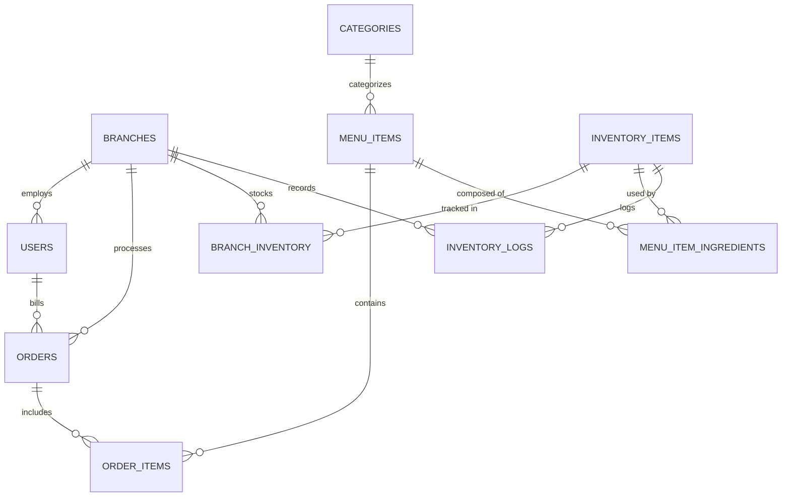

# VCafe — Multi-Branch Cafe Management System

A cloud-based business operations platform for multi-branch specialty cafes — live POS billing, recipe-based inventory deductions, and consolidated branch analytics.

🌐 **GitHub Repository:** [github.com/vidhyawalke/vcafe-multi-branch-management](https://github.com/vidhyawalke/vcafe-multi-branch-management)

---

## What the Project Does

Managing daily operations across multiple cafe outlets often leads to operational friction — tracking stock on loose paper pads, manually tallying shift cash drawers, and lacking real-time visibility into branch inventory levels.

A specialty cafe in Goa with branches in Panjim and Anjuna was experiencing ingredient run-outs during tourist rushes while the other outlet had excess stock. At the same time, end-of-day sales settlements were logged across WhatsApp messages and paper slips, making it difficult for the owner to evaluate store performance.

The goal was to build a full-stack web application that unifies counter operations, stock replenishment, and multi-outlet business analytics into a single interface.

The app was built using React, Node.js, Express, and PostgreSQL. Counter staff get a touch-friendly POS billing terminal with instant thermal receipt generation, outlet managers track live inventory levels with automated low-stock warnings, and the owner gets real-time consolidated sales analytics across all branches.

Whenever an order is billed, the system uses recipe mappings to automatically deduct raw ingredients (beans, milk, pastries) directly from that specific branch's inventory ledger.

---

## Why It Is Useful

1. **Eliminates Manual Stock Guesswork:** Menu items automatically deduct ingredients in real-time based on predefined recipe weights.
2. **Prevents Stockouts:** Visual alert triggers notify managers when raw materials drop below safe reorder thresholds.
3. **Role-Based Access Control:** Separate permission boundaries for Owner (all outlets), Store Managers (branch operations), and Staff (POS billing).
4. **Instant Thermal Receipts:** Generates formatted customer receipts with tax breakdown (5% GST), invoice numbering, and print support.
5. **Multi-Branch Visibility:** Consolidates daily revenue trends, average ticket sizes, and payment breakdowns across branches.
6. **Dual Database Engine:** Connects to PostgreSQL for production cloud deployment or runs with zero-config local storage for instant evaluation.

---

## Getting Started

### Prerequisites

- **Node.js** (v18 or higher)
- **npm** (v9 or higher)
- *(Optional)* **PostgreSQL** installed locally on port 5432 or a cloud PostgreSQL database URL.

### Installation

```bash
git clone https://github.com/vidhyawalke/vcafe-multi-branch-management.git
cd vcafe-multi-branch-management
npm run install:all
```

### Running the Application

1. **Initialize and Seed Demo Data:**
   ```bash
   npm run seed
   ```
   *(Populates Panjim and Anjuna branches, 5 staff accounts, full menu items, recipe ingredients, stock levels, and sample past orders).*

2. **Start Development Servers:**
   ```bash
   # Start backend API (runs on http://localhost:5000)
   npm run server

   # Start frontend interface (runs on http://localhost:3000)
   npm run client
   ```

3. **(Optional) Connect Your Local PostgreSQL Database:**
   If you have PostgreSQL installed on port 5432, run:
   ```bash
   npm run db:postgres -- YOUR_POSTGRES_PASSWORD
   ```
   This automatically creates `vcafe_db`, runs the schema DDL, seeds the data, and updates `.env`.

---

## Features

- **Touch POS Checkout —** Fast category filtering, active bill drawer, dining mode toggle (Dine In / Takeaway), table numbers, and 5% GST calculations.
- **Recipe-Based Stock Deduction —** Ordering a Flat White automatically deducts 18g of coffee beans and 200ml of milk from the outlet's live inventory.
- **Low-Stock Alert Banners —** Immediate visual warnings when materials drop below minimum operating safety thresholds.
- **Stock Restock & Waste Logging —** Store managers can log supplier replenishment crates or write off spoilage with audit notes.
- **Inter-Branch Stock Transfers —** Transfer materials between Panjim Flagship and Anjuna Coastal branches with transaction logs.
- **Executive Sales Analytics —** Consolidated vs branch-level revenue, order counts, average order values, and 7-day revenue trend line chart.
- **Payment Mode Settlement —** Tracks transactions across UPI, Credit/Debit Card, and Cash.
- **1-Click Recruiter Persona Switcher —** Seamlessly test Owner, Manager, and Staff views directly from the top navigation bar.

---

## Project Structure

```text
vcafe-multi-branch-management/
├── client/                      # React Frontend (Vite)
│   ├── src/
│   │   ├── components/
│   │   │   ├── Sidebar.jsx      # Left sidebar navigation (GoMeal style)
│   │   │   ├── TopHeader.jsx    # Page header & recruiter persona switcher
│   │   │   ├── PosTab.jsx       # POS menu catalog & active billing drawer
│   │   │   ├── DashboardTab.jsx # Sales analytics & trend line chart
│   │   │   ├── InventoryTab.jsx # Raw material ledger & stock status
│   │   │   ├── BranchesTab.jsx  # Outlet locations & RBAC team directory
│   │   │   ├── ReceiptModal.jsx # Authentic thermal POS receipt modal
│   │   │   ├── RestockModal.jsx # Supplier restock & waste logger
│   │   │   └── TransferModal.jsx# Inter-branch inventory transfer
│   │   ├── services/
│   │   │   └── api.js           # Fetch API client with JWT injection
│   │   ├── App.jsx              # Main application shell
│   │   └── index.css            # Clean, warm cafe design system
├── server/                      # Express Backend REST API
│   ├── src/
│   │   ├── config/
│   │   │   └── db.js            # Dual PostgreSQL & SQLite query adapter
│   │   ├── controllers/         # Auth, Orders, Inventory, Reports, Branches
│   │   ├── middleware/          # JWT verification & RBAC role guards
│   │   ├── routes/              # Express API endpoints
│   │   ├── db/
│   │   │   ├── schema.sql       # Relational database DDL schema
│   │   │   ├── seed.js          # Panjim & Anjuna demo data seed script
│   │   │   └── setupPostgres.js # Local PostgreSQL automated setup script
│   │   ├── app.js               # Express application configuration
│   │   └── index.js             # Server startup bootstrap
├── render.yaml                  # 1-click cloud deployment blueprint for Render
├── vercel.json                  # Frontend hosting configuration for Vercel
└── package.json                 # Workspace scripts
```

---

## Database Schema & Entity Relationships



---

## Tech Stack

| Layer | Technology |
|---|---|
| **Frontend Framework** | React 18 with Vite |
| **Styling** | Vanilla CSS3 with custom variables (Clean warm theme) |
| **Icons** | Lucide React |
| **Backend Framework** | Node.js & Express |
| **Authentication** | JSON Web Tokens (`jsonwebtoken`) & `bcryptjs` |
| **Access Control** | Role-Based Access Control (`owner`, `manager`, `staff`) |
| **Database** | PostgreSQL (`pg-pool`) with SQLite zero-config fallback |
| **Cloud Hosting** | Render (Web Service + PostgreSQL) & Vercel |

---

## Demo Accounts

| Persona | Role | Email | Password | Access Scope |
|---|---|---|---|---|
| **Vidhya Walke** | `owner` | `owner@vcafe.com` | `admin123` | All Goa Outlets |
| **Rahul Deshmukh** | `manager` | `manager.panjim@vcafe.com` | `manager123` | VCafe Panjim (Flagship) |
| **Kevin Lobo** | `staff` | `staff.anjuna@vcafe.com` | `staff123` | VCafe Anjuna (Beachside) |

*(Use the demo buttons in the top navigation bar to switch personas with one click).*

---

## Getting Help

If you run into issues or have questions, open a [GitHub issue](https://github.com/vidhyawalke/vcafe-multi-branch-management/issues) in this repository.

---

## Maintainer

Built and maintained by [Vidhya Walke](https://github.com/vidhyawalke).

Contributions, bug reports, and suggestions are welcome via pull request or issue.
